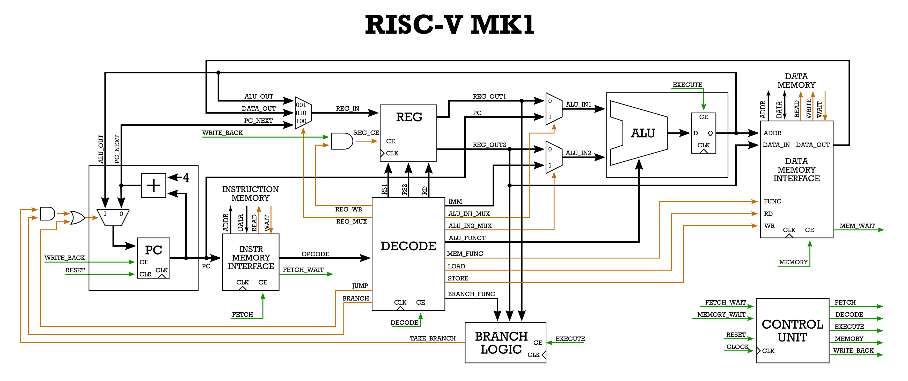

# RISC-V MK1

<!-- TABLE OF CONTENTS -->

  
Table of Contents

  <ol>
    <li><a href="#about-the-project">About The Project</a></li>
    <li><a href="#installation-newlib">Installation (Newlib)</a></li>
    <li><a href="#installation-ghdl">Installation (GHDL)</a></li>
  </ol>

<!-- ABOUT THE PROJECT -->
## About The Project
Multicycle RISC-V CPU implemented in VHDL.

<!-- COMPILING GCC -->
### Installation (Newlib)

https://github.com/riscv-collab/riscv-gnu-toolchain\
To build the cross-compiler, pick an install path.\
If you choose, say, `/opt/riscv`, then add `/opt/riscv/bin` to your `PATH` now.\
Then, simply run the following command:

    git clone https://github.com/riscv/riscv-gnu-toolchain
    cd riscv-gnu-toolchain
    ./configure --prefix=/opt/riscv --with-arch=rv32i --with-abi=ilp32
    sudo make

<!-- COMPILING GHDL -->
### Installation (GHDL)

https://github.com/ghdl/ghdl\
To build GHDL, pick an install path.\
If you choose, say, `/usr/local` then, simply run the following command

    sudo apt-get install gnat-12
    git clone https://github.com/ghdl/ghdl.git
    cd ghdl
    mkdir build
    cd build
    ../configure --prefix=/usr/local
    sudo make
    sudo make install